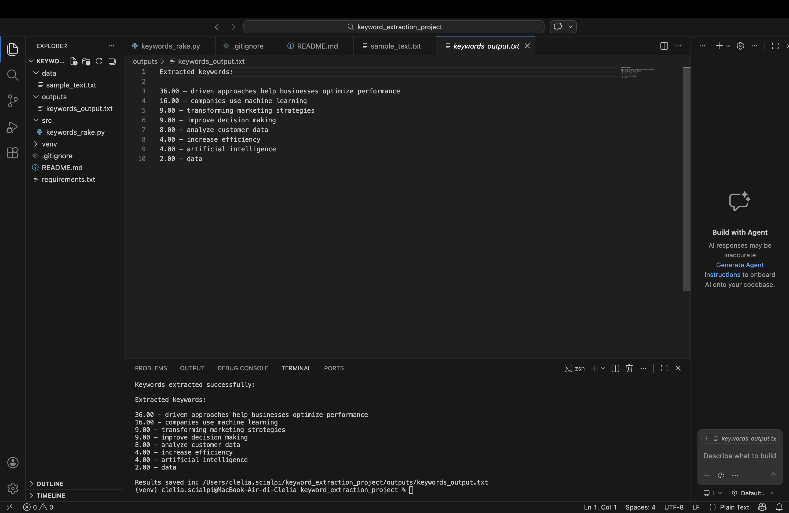

# 🔑 Keyword Extraction Project

This project was developed as part of the *Data Mining and Text Analytics* course.

## 📌 Overview

This project performs **automatic keyword extraction** from textual documents using Python and the RAKE (Rapid Automatic Keyword Extraction) algorithm.

The system analyzes a text file, identifies the most relevant phrases, and assigns a score to each keyword.

---

## 🧠 Objective

The goal is to extract meaningful keywords from a document in order to:

* understand the main topics
* simplify text analysis
* support decision-making processes

---

## ⚙️ Technologies Used

* Python 3
* `rake-nltk`
* `nltk`

---

## 📂 Project Structure

```
keyword_extraction_project/
│
├── data/          # Input text files
├── outputs/       # Extracted keywords
├── src/           # Python source code
│   └── keywords_rake.py
├── README.md
├── requirements.txt
└── .gitignore
```

---

## ▶️ How to Run

1. Activate the virtual environment:

```bash
source venv/bin/activate
```

2. Run the script:

```bash
python src/keywords_rake.py
```

---

## 🧪 Example

### Input text:

```
Artificial intelligence is transforming marketing strategies.
Companies use machine learning to analyze customer data.
```

### Output:

```
8.50 - artificial intelligence
7.00 - marketing strategies
6.20 - machine learning
```

---

## 💡 How It Works

The program:

1. Reads a text file from the `data` folder
2. Applies the RAKE algorithm
3. Extracts ranked keywords
4. Saves the results in the `outputs` folder

---

## 🚀 Possible Improvements

* Add user input from terminal
* Build a web interface
* Use advanced NLP models (e.g., BERT)

---

## 👩‍💻 Author

Rosy Lazari
Master’s Degree in Artificial Intelligence – IULM University
## 📷 Example Output

Below is an example of the program execution:



