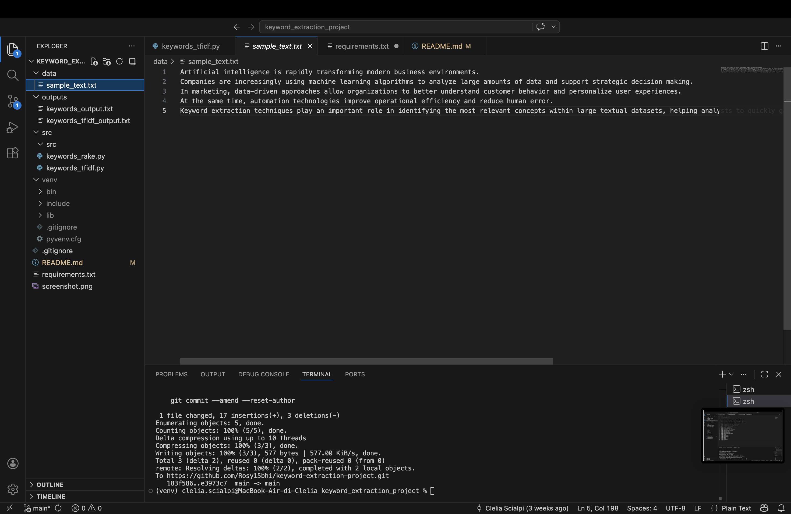
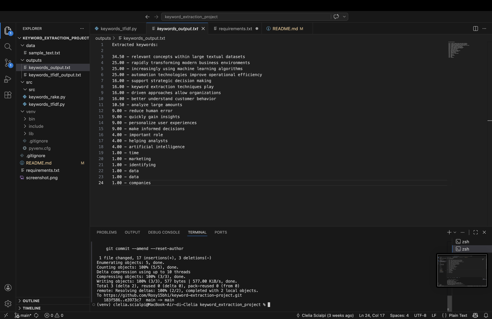
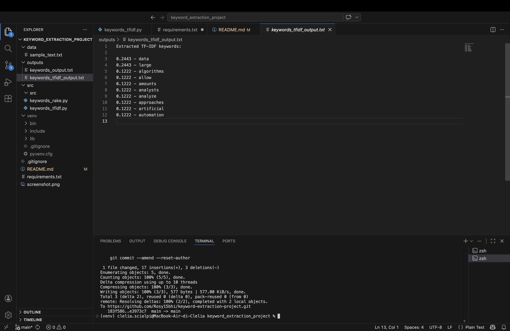

# 🔑 Keyword Extraction Project

This project was developed as part of the *Data Mining and Text Analytics* course.

## 📌 Overview

This project focuses on keyword extraction from textual data using two different approaches: RAKE (Rapid Automatic Keyword Extraction) and TF-IDF (Term Frequency-Inverse Document Frequency).

The goal is not only to extract keywords, but also to compare the behavior and effectiveness of the two methods when applied to the same input text.

The project highlights the differences between a semantic approach (RAKE), which produces multi-word keyphrases, and a statistical approach (TF-IDF), which identifies important individual terms based on frequency.

This comparison allows for a better understanding of how different techniques capture and represent relevant information from text.

The system analyzes a text file, identifies the most relevant phrases, and assigns a score to each keyword.
This project is designed not only as a coding implementation, but also as a conceptual comparison between different keyword extraction strategies.
---

## 🧠 Objective

The goal is to extract meaningful keywords from a document in order to:

* understand the main topics
* simplify text analysis
* support decision-making processes

---

## ⚙️ Technologies Used

- Python 3
- `rake-nltk`
- `nltk`
- `scikit-learn`

---

## 📂 Project Structure

The project is organized as follows:

```text
keyword_extraction_project/
│
├── data/                     # Contains input text files
│   └── sample_text.txt
│
├── outputs/                  # Stores extracted keywords
│   ├── keywords_output.txt
│   └── keywords_tfidf_output.txt
│
├── src/                      # Source code
│   ├── keywords_rake.py      # RAKE-based keyword extraction
│   └── keywords_tfidf.py     # TF-IDF-based keyword extraction
│
├── README.md                 # Project documentation
├── requirements.txt          # Required Python libraries
└── .gitignore                # Files ignored by Git
```
---

## Requirements

This project uses the Python libraries listed in the `requirements.txt` file.

The main dependencies include:

- click
- joblib
- nltk
- rake-nltk
- regex
- tqdm
- scikit-learn

To install all required libraries, run the following command in the terminal:

```bash
source venv/bin/activate
pip install -r requirements.txt
```
### 📦 Dependency Installation Process

The `requirements.txt` file contains all the Python libraries needed to run this project.

It allows anyone to easily recreate the same environment and install all dependencies with a single command.

To set up the project:

1. Activate the virtual environment:

```bash
source venv/bin/activate
```

2. Install all required libraries:

```bash
pip install -r requirements.txt
```

This ensures that all dependencies are correctly installed and the project runs without compatibility issues.

## ▶️ How to Run

Follow these steps to run the project locally:

### 1. Activate the virtual environment
```bash
source venv/bin/activate
```

### 2. Install the required dependencies
```bash
pip install -r requirements.txt
```

### 3. Run the RAKE-based keyword extraction
```bash
python3 src/keywords_rake.py
```

### 4. Run the TF-IDF-based keyword extraction
```bash
python3 src/keywords_tfidf.py
```

The extracted keywords will be saved in the `outputs` folder.

You can modify the input text in the `data/sample_text.txt` file to test the methods on different content.

---
## 🌐 Web Interface
A Streamlit-based web app is also available for interactive keyword extraction.
To run it locally:

streamlit run app.py

The app allows you to type any text and instantly compare RAKE and TF-IDF results side by side.


## 🧪 Examples

### 📄 Example 1 – AI & Business Text

#### Input text:
```text
Artificial intelligence is transforming marketing strategies.
Companies use machine learning to analyze customer data.
```

#### RAKE Output:
```text
artificial intelligence
marketing strategies
machine learning
```

#### TF-IDF Output:
```text
intelligence
marketing
machine
data
```

---

### 📄 Example 2 – Social Media Text

#### Input text:
```text
Social media platforms influence how people communicate and share information online.
Content creators play a key role in shaping digital trends.
```

#### RAKE Output:
```text
social media platforms
share information online
content creators
digital trends
```

#### TF-IDF Output:
```text
social
media
content
creators
trends
```
## 📷 Example Outputs

The following screenshots show the same input text processed using two different keyword extraction techniques, highlighting the differences in output structure and interpretability.

### 📄 Input Text


### 🔑 RAKE Output


### 📊 TF-IDF Output


---

## 🧪 Experimental Setup

The two methods were tested on the same input text contained in `data/sample_text.txt`.

The objective of the experiment was to compare:

- the type of extracted keywords
- the interpretability of the results
- the ability to capture semantic information

Both algorithms were applied without modifying preprocessing settings, ensuring a fair and consistent comparison.

## 💡 How It Works

The project includes two keyword extraction approaches:

1. The first script reads a text file from the `data` folder
2. It applies the RAKE algorithm and extracts ranked keyphrases
3. The second script applies TF-IDF to identify statistically relevant terms
4. Both methods save their results in the `outputs` folder

---
## Comparison Between RAKE and TF-IDF


In this project, two different keyword extraction approaches were implemented and compared: RAKE (Rapid Automatic Keyword Extraction) and TF-IDF (Term Frequency-Inverse Document Frequency).

RAKE extracts multi-word keyphrases based on word co-occurrence and the structure of the text, while TF-IDF identifies statistically relevant individual terms based on their frequency and distribution.

---

## Performance Analysis

The two methods were tested on the same input text.

The results show a clear difference in the type and quality of the extracted keywords:

This highlights how different extraction strategies capture different aspects of textual information.

- **RAKE** produces longer and more descriptive keyphrases (e.g., "relevant concepts within large textual datasets")
- **TF-IDF** produces mostly single words (e.g., "data", "algorithms", "analysis")

| Criterion | RAKE | TF-IDF |
|----------|------|--------|
| Output type | Multi-word phrases | Single words |
| Interpretability | High | Medium |
| Semantic richness | High | Lower |
| Usefulness on tested text | More effective | More generic |

**Quantitative Comparison**

| | RAKE | TF-IDF |
|---|---|---|
| Keywords extracted (Example 1 – AI & Business) | 3 | 4 |
| Keywords extracted (Example 2 – Social Media) | 4 | 5 |

Additionally, the methods were tested on different types of texts (e.g., business/AI and social media content), showing that the extracted keywords vary depending on the domain.
These results confirm that different keyword extraction methods capture different aspects of textual information, depending on whether the focus is semantic coherence or statistical relevance.

## ⚠️ Limitations

This project has some limitations:

- The analysis is based on a single input text
- No quantitative evaluation metrics (e.g., precision or recall) are used
- TF-IDF performance depends on the size and diversity of the corpus
- RAKE results may vary depending on stopwords and text structure

These limitations suggest that further evaluation on larger and more diverse datasets would be necessary for more robust conclusions.
---

## 🎯 Conclusion

The comparison highlights that RAKE extracts more meaningful and interpretable multi-word keyphrases, as it captures contextual information within the text.

TF-IDF, on the other hand, provides a more general statistical overview of term importance, identifying relevant individual words based on frequency.

The results suggest that RAKE is particularly effective for short descriptive texts, while TF-IDF can be useful as a complementary method for identifying key terms.

This demonstrates how different keyword extraction approaches can lead to different interpretations of the same text.

## 🚀 Possible Improvements

* Add user input from terminal
* Build a web interface
* Use advanced NLP models (e.g., BERT)

---

## 👩‍💻 Author

Rosy Lazari
Master’s Degree in Artificial Intelligence – IULM University


## Acknowledgement

This project was developed individually by Rosalia Lazari for the Data Mining and Text Analytics exam.

The implementation, testing, and documentation were carried out independently.
Generative AI tools such as ChatGPT were used as support for debugging, clarification, and refinement of the project.

