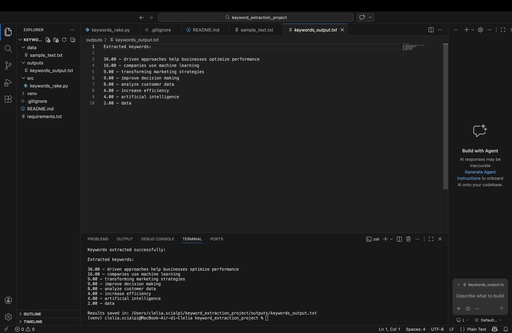

# 🔑 Keyword Extraction Project

This project was developed as part of the *Data Mining and Text Analytics* course.

## 📌 Overview

This project performs **automatic keyword extraction** from textual documents using Python and the RAKE (Rapid Automatic Keyword Extraction) algorithm.

The system analyzes a text file, identifies the most relevant phrases, and assigns a score to each keyword.

---

## 🧠 Objective

The goal is to extract meaningful keywords from a document in order to:

* understand the main topics
* simplify text analysis
* support decision-making processes

---

## ⚙️ Technologies Used

- Python 3
- `rake-nltk`
- `nltk`
- `scikit-learn`

---

## Project Structure
keyword_extraction_project/
│
├── data/                     # Input text files
├── outputs/                  # Extracted keywords
│   ├── keywords_output.txt
│   └── keywords_tfidf_output.txt
├── src/                      # Python source code
│   ├── keywords_rake.py
│   └── keywords_tfidf.py
├── README.md
├── requirements.txt
└── .gitignore


## Requirements

This project uses the Python libraries listed in the `requirements.txt` file.

The main dependencies include:

- click
- joblib
- nltk
- rake-nltk
- regex
- tqdm
- scikit-learn

To install all required libraries, run the following command in the terminal:

```bash
source venv/bin/activate
pip install -r requirements.txt
```

## ▶️ How to Run

1. Activate the virtual environment:

```bash
source venv/bin/activate
```

2. Run the RAKE version:
python3 src/keywords_rake.py

3. Run the TF-IDF version:
python3 src/keywords_tfidf.py

---

## 🧪 Example

### Input text:

```
Artificial intelligence is transforming marketing strategies.
Companies use machine learning to analyze customer data.
```

### Output:

```
8.50 - artificial intelligence
7.00 - marketing strategies
6.20 - machine learning
```
## 📷 Example Output

Below is an example of the program execution:


---

## 💡 How It Works

The project includes two keyword extraction approaches:

1. The first script reads a text file from the `data` folder
2. It applies the RAKE algorithm and extracts ranked keyphrases
3. The second script applies TF-IDF to identify statistically relevant terms
4. Both methods save their results in the `outputs` folder

---
## Comparison Between RAKE and TF-IDF


In this project, two different keyword extraction approaches were implemented and compared: RAKE (Rapid Automatic Keyword Extraction) and TF-IDF (Term Frequency-Inverse Document Frequency).

RAKE extracts multi-word keyphrases based on word co-occurrence and the structure of the text, while TF-IDF identifies statistically relevant individual terms based on their frequency and distribution.

---

## Performance Analysis

The two methods were tested on the same input text.

The results show a clear difference in the type and quality of the extracted keywords:

This highlights how different extraction strategies capture different aspects of textual information.

- **RAKE** produces longer and more descriptive keyphrases (e.g., "relevant concepts within large textual datasets")
- **TF-IDF** produces mostly single words (e.g., "data", "algorithms", "analysis")

| Criterion | RAKE | TF-IDF |
|----------|------|--------|
| Output type | Multi-word phrases | Single words |
| Interpretability | High | Medium |
| Semantic richness | High | Lower |
| Usefulness on tested text | More effective | More generic |

Additionally, the methods were tested on different types of texts (e.g., business/AI and social media content), showing that the extracted keywords vary depending on the domain.

---

## Conclusion

The comparison shows that RAKE is more effective for extracting meaningful and interpretable keyphrases from short descriptive texts, as it captures contextual information.

TF-IDF, on the other hand, provides a more general statistical overview of term importance, but the results are less expressive.

For this reason, RAKE was considered the most suitable method for this project, while TF-IDF was used as a complementary approach for comparison.

## 🚀 Possible Improvements

* Add user input from terminal
* Build a web interface
* Use advanced NLP models (e.g., BERT)

---

## 👩‍💻 Author

Rosy Lazari
Master’s Degree in Artificial Intelligence – IULM University


## Acknowledgement

This project was developed individually by Rosalia Lazari for the Data Mining and Text Analytics exam.

The implementation, testing, and documentation were carried out independently.
Generative AI tools such as ChatGPT were used as support for debugging, clarification, and refinement of the project.

